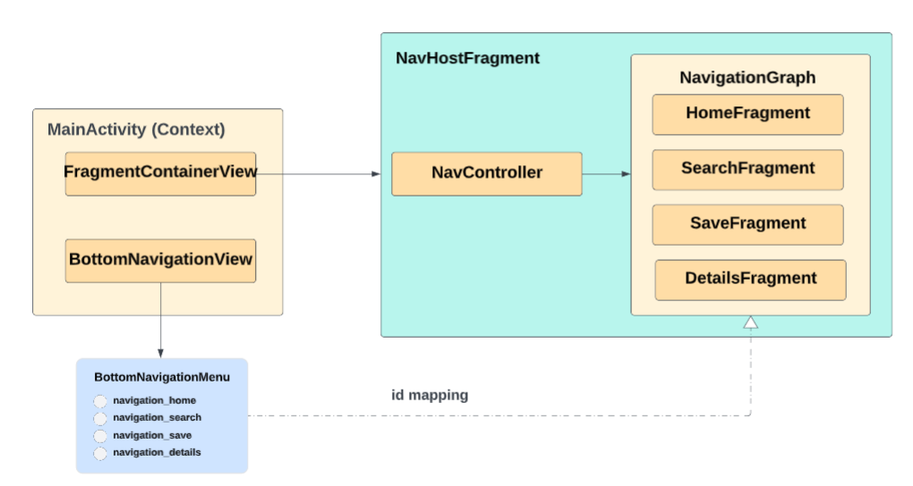
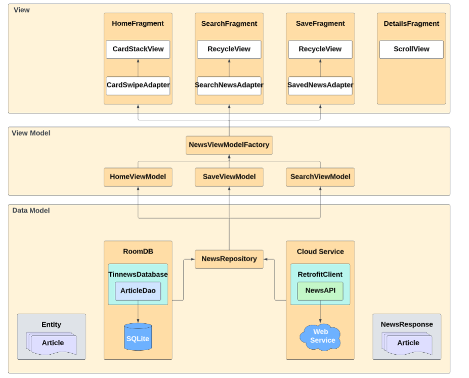
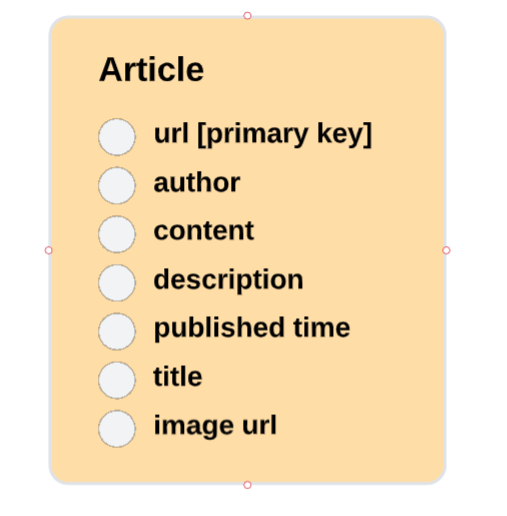

#  Portable Tinder-Style News Browsing Android Application

### *Introduction*

---

### *Developer Environment*

The Android development for this Java project is based in Android Studio. In order to visualize the front end GUI and test backend logics, this project uses the emulator inside Android Studio to display the app outlook. The virtual device configuration for this emulator is baesed on `Pixel` with `Tiramisu` API33 as the x86 image. 

---

### *Frontend Software Architecture*

Figure 1. Frontend software architecture design process flow (click the diagram to view in a larger view)

The main activity xml layout consists of frgament container view (`FragmentContainerView`) and bottom navigation view (`BottomNavigationView`) as the overall front-end GUI architecture. The `FragmentContainerView` contains a navigation graph which connects all the app fragments (home, search, save, details). The navigation graph is managed by navigation controller to switch with different fragments. The `NavigationUI` setups the navigation controller (`NavController`) and bottom navigation view (`BottomNavigationView`) together so that the correspondin fragment will be displayed on screen when user clicks a specific tab inside bottom navigation view. Each tab id and associated fragment id inside navigation graph should be matched up so that navigation controller (`NavController`) can find the fragment and display it on the 
frgament container view (`FragmentContainerView`).

---

### *Backend Software Architecture*

The backend software design for this Android application development follows the `MVVM` (Data Model-View-View Model) design architecture. 

The data model is the layer of retrieving `Article` data sources either from local Room DB (more discussion on database section) or cloud service. In order to access the external service in a convenient manner, this project utilizes of `Retrofit` client as the endpoint to retreiving data by `NewsAPI`. The `Retrofit` client is an upper layer to hide the complexity of `HTTP` request/response, developer can just use the `NewsAPI` created from `Retrofit` client builder to access external data. This project wraps up both the database query and external API calls into a repository called `NewsRepository` so that developer can just use this instance to access data rather than directly request data in a lower level.

The view is the layer of displaying data source in a `Fragment` manner. A `Fragment` typically consists of `View` and `Adapter`. Based on different product fuctional requirement, the `View` can be `CardStackView`, `RecycleView`, `ScrollView` etc. Those `View`s are generated through `view binding` which binds the view from XML layout to Java object field. The `Adapter` is used to generate `ViewHolder` (view binding from item view XML layout) and binds the data source to those `ViewHolder`s.
There is a `Manager` inside `View` to manage the life cycle of `ViewHolder`s generated from `Adapter`. Therefore, developer needs to pass `Adapter` and `Manager` to `View` in each `Fragment`.

In order to connect the view layer and data model layer together, there is a middle layer called view model. The `ViewModel` for each different `Fragment` is generated
in a factory builder design pattern through `NewsViewModelFactory`, which provides the `NewsRepository` to each `ViewModel` so that the data source can be shared to view layer. The `ViewModel` gets data through calling `NewsRepository` and wait/observe the data response. Since the data response is wrapped inside `LiveData<T>`, `ViewModel` can observe it. Once the data response appears, `Adapter` will sync the data response to its inner data field and call `notifyDataSetChanged()`, which will
trigger the `ViewHolder` to re-bind the new data source so that view layer can be updated. 

---

### *Backend Software Components*

#### 1. Home Page

The home page displays the news article data in a card stack view with like/unlike buttons underneath it. Users can like/unlike an article, the liked articles will be saved into Room DB. Since saving data/DB query is a relative heavy task, this project uses other thread (not main thread/GUI thread)to do this task in an asyncrhonized manner so that the GUI thread is no blocking from other user actions. The asynced tasks will be put under a message queue maintained by looper, the available thread will pick up the task from the message queue through handler. Unlike `Retrofit` infrastructure providing `Call<T>` wrapper for asynced tasks inside `NewsAPI`, the Room DB layer does not provide such similar structure, developer needs to create asynced task class from `AsyncTask` and manually do it.

The `HomeFragment` inherits from `CardStackListener` so that it can act as a listener to the like/unlike button click events. When user triggers such event, the `Manager` will notify `HomeFragment` and it can do the data saving process mentiioned above.

#### 2. Search Page

The search page displays the data response from user searching request in a recycle view. The news search view also needs to set a listener to listen for user searching request event. Once the event triggers, the `SearchFragment` will ask `SearchViewModel` to retrieve news data source through external `NewsAPI`. As mentioned
 above, the  `Retrofit` infrastructure provides `Call<T>` wrapper for asynced tasks inside `NewsAPI`, it will process the task in other thread (not main thread/GUI thread) as well. 

#### 3. Save Page

The save page displays all the liked news article from user, the liked news artitlces will be retrieved through Room DB query. If user unlikes an article in this page,
there is also an asynced task to delete this article through Room DB query. Since the articles are wrapped inside `LiveData<T>`, the `SaveVideModel` observes the update of articles, `SavedNewsAdapter` will sync the data response to its inner data field and call `notifyDataSetChanged()`, which will trigger the `ViewHolder` to re-bind the new data source so that view layer can be updated.  

#### 4. Details Page

The details page shows the details of an article if user clicks an article either in search page or save page. It only contains a scrollview. The `SearchFragment` needs to implement the `ItemCallback` interface inside `SearchNewsAdapter`which containes the callback method for switching to details fragment. The same logic applies 
to the save page.

---
### *Database*

Similar to Hibernate in Spring MVC framework, `Room` is an annotaion based ORM solution for SQLite data query on Android platform. The `Room` DB creates the `TinnewsDatabase` which uses `ArticleDao` data access object to do SQLite data query. The entity of data is exposed as a Java object on developer side, which makes the 
data query more convenient so that developer does not need to use SQL language to access database. The schema for an article entity shows below:

Figure 3. RDBMS schema (article) 

---
 
### *Deployment*
